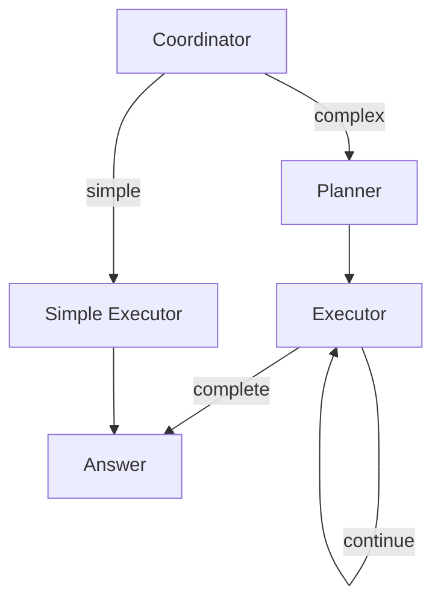

# Palantir OSDK Bot

A PocketFlow cookbook example demonstrating how to build an agentic chatbot that queries and analyzes data from Palantir Foundry using the OSDK (Ontology SDK).

<p align="center">
  
</p>

## Features

- 🔮 **Natural Language Queries**: Ask questions about your Foundry data in plain English
- 📊 **Automatic Visualization**: Generate Plotly charts from your data
- 🧠 **Full Transparency**: See every step of the agent's reasoning
- 🤖 **Multi-Agent Architecture**: Coordinator-Planner-Executor pattern for robust query handling
- 💬 **Conversation Memory**: Context is maintained across queries
- 🧪 **Mock Data Included**: Works out-of-the-box with pharmaceutical R&D sample data

## Architecture

### Multi-Agent Flow (Coordinator-Planner-Executor)



## Quick Start

### 1. Install Dependencies

```bash
pip install -r requirements.txt
```

### 2. Set Your OpenAI API Key

```bash
export OPENAI_API_KEY="your-api-key-here"
```

### 3. Run the Streamlit App

```bash
streamlit run app.py
```

### 4. Or Use the CLI

```bash
# Interactive mode
python main.py

# Single query
python main.py "Show me all completed experiments"

# Complex query
python main.py "Compare turbidity across different surfactants"
```

## Example Queries

Try these with the mock data:

| Query                                                | What It Does                   |
| ---------------------------------------------------- | ------------------------------ |
| "What object types are available?"                   | Lists all queryable data types |
| "Show me all completed experiments"                  | Simple filtered query          |
| "List samples using Polysorbate 80"                  | Filter by surfactant           |
| "Show results for experiment EXP001"                 | Query linked objects           |
| "Compare turbidity across surfactants"               | Analysis + visualization       |
| "Create a chart of SEC monomer values by time point" | Direct visualization request   |

## Mock Data Structure

The included mock data simulates a pharmaceutical R&D domain:

```
Protein          (3 records)  - Proteins being studied
├── Experiment   (5 records)  - Research experiments
│   └── Sample   (36 records) - Formulation samples
│       └── Result (500+ records) - Measurement results
└── Excipient    (7 records)  - Formulation components
```

### Object Types

| Type           | Description             | Key Fields                                  |
| -------------- | ----------------------- | ------------------------------------------- |
| **Protein**    | Proteins being studied  | name, molecular_weight, type                |
| **Experiment** | Research experiments    | name, status, lead_scientist                |
| **Sample**     | Test formulations       | surfactant, concentration, stress_condition |
| **Result**     | Measurements            | measurement_type, time_point, value         |
| **Excipient**  | Formulation ingredients | name, category, supplier                    |

## Project Structure

```
pocketflow-palantir-osdk/
├── app.py                 # Streamlit chat UI
├── main.py                # CLI entry point
├── nodes.py               # PocketFlow node definitions
├── multi_agent_flow.py    # Multi-agent flow
├── prompts.py             # LLM prompts
├── utils/
│   ├── __init__.py
│   ├── call_llm.py        # LLM wrapper (OpenAI-compatible)
│   ├── osdk_client.py     # OSDK interface + mock data
│   ├── streaming.py       # Real-time streaming utilities
│   └── visualization.py   # Plotly chart generation
├── docs/
│   └── design.md          # Detailed architecture docs
├── requirements.txt
└── README.md
```

## Integrating with Real Palantir OSDK

### Step 1: Generate Your OSDK

Use Palantir's SDK generator to create a Python package for your ontology.

### Step 2: Implement the Client

Edit `utils/osdk_client.py` and implement `PalantirOSDKClient`:

```python
from your_generated_osdk import FoundryClient

class PalantirOSDKClient(BaseOSDKClient):
    def __init__(self):
        # Your authentication setup
        self.client = FoundryClient()

    def list_object_types(self):
        return [obj.__name__ for obj in self.client.ontology.objects]

    def get_object_schema(self, object_type):
        # Extract schema from your OSDK objects
        obj_class = getattr(self.client.ontology.objects, object_type)
        return {
            "description": obj_class.__doc__,
            "properties": {f.name: str(f.type) for f in obj_class.fields}
        }

    def query_objects(self, object_type, filters=None, limit=100):
        obj_class = getattr(self.client.ontology.objects, object_type)
        query = obj_class

        if filters:
            for field, value in filters.items():
                query = query.where(getattr(obj_class, field) == value)

        results = query.take(limit)
        return pd.DataFrame([obj.__dict__ for obj in results])

    def get_linked_objects(self, object_type, primary_key, link_type):
        # Use your OSDK's link traversal methods
        ...
```

### Step 3: Configure Environment

```bash
# Disable mock data
export USE_MOCK_OSDK=false

# Your Palantir credentials (method depends on your setup)
export PALANTIR_TOKEN="..."
```

## Configuration Options

### Environment Variables

| Variable          | Default        | Description                           |
| ----------------- | -------------- | ------------------------------------- |
| `OPENAI_API_KEY`  | Required       | Your OpenAI API key                   |
| `OPENAI_BASE_URL` | OpenAI default | Custom endpoint (Azure, local models) |
| `OPENAI_MODEL`    | `gpt-4o`       | Model to use                          |
| `USE_MOCK_OSDK`   | `true`         | Use mock data vs real OSDK            |

### Using Azure OpenAI

```bash
export OPENAI_API_KEY="your-azure-key"
export OPENAI_BASE_URL="https://your-resource.openai.azure.com/openai/deployments/your-deployment"
export OPENAI_MODEL="gpt-4o"
```

### Using Local Models (Ollama)

```bash
export OPENAI_BASE_URL="http://localhost:11434/v1"
export OPENAI_API_KEY="ollama"  # Ollama doesn't need real key
export OPENAI_MODEL="llama3"
```

## How It Works

### 1. User Query → Coordinator

The `CoordinatorNode` analyzes the query complexity:

- **Simple queries**: Direct execution with basic fetch and answer
- **Complex queries**: Routes to the Planner for multi-step planning

### 2. Planner → Executor

For complex queries, the `PlannerNode` creates a step-by-step execution plan:

- `fetch`: Query data from the OSDK
- `analyze`: Use LLM to analyze fetched data
- `visualize`: Generate a Plotly chart
- `answer`: Provide final response

The `ExecutorNode` executes each step in sequence.

### 3. Transparency

Every LLM prompt and response is logged to `shared["thinking_steps"]`, displayed in the UI's "Agent Thinking" expander.

## Extending the Bot

### Adding New Object Types (Mock Data)

1. Edit `utils/osdk_client.py`
2. Add data generation in `_initialize_mock_data()`
3. Add schema definition in `self._schemas`
4. Add to `self._data` mapping

### Adding New Actions

1. Create a new Node class in `nodes.py`
2. Update the `PlannerNode` prompts to include the new action
3. Add handling in `ExecutorNode.exec()` for the new action type

### Adding New Chart Types

1. Edit `utils/visualization.py`
2. Add handling in `generate_chart()` for your chart type

## Files

| File                                                 | Description                                     |
| ---------------------------------------------------- | ----------------------------------------------- |
| [`app.py`](./app.py)                                 | Streamlit chat interface with full transparency |
| [`main.py`](./main.py)                               | CLI interface for testing                       |
| [`nodes.py`](./nodes.py)                             | All PocketFlow node definitions                 |
| [`multi_agent_flow.py`](./multi_agent_flow.py)       | Multi-agent coordinator-planner flow            |
| [`utils/call_llm.py`](./utils/call_llm.py)           | OpenAI-compatible LLM wrapper                   |
| [`utils/osdk_client.py`](./utils/osdk_client.py)     | OSDK interface + mock implementation            |
| [`utils/visualization.py`](./utils/visualization.py) | Plotly chart generation                         |
| [`docs/design.md`](./docs/design.md)                 | Detailed architecture documentation             |

## Related Cookbooks

- [pocketflow-agent](../pocketflow-agent) - Basic agent pattern
- [pocketflow-streamlit-fsm](../pocketflow-streamlit-fsm) - Streamlit state machine
- [pocketflow-text2sql](../pocketflow-text2sql) - Natural language to SQL
- [pocketflow-multi-agent](../pocketflow-multi-agent) - Multi-agent communication
