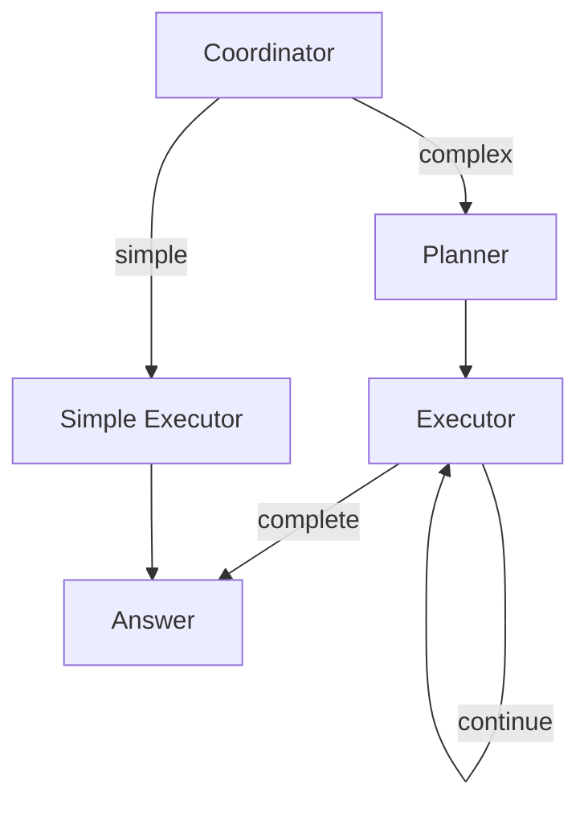

# Palantir OSDK Bot

A PocketFlow cookbook example demonstrating how to build an agentic chatbot that queries and analyzes data from Palantir Foundry using the OSDK (Ontology SDK).

<p align="center">
  
</p>

## Features

- 🔮 **Natural Language Queries**: Ask questions about your Foundry data in plain English
- 📊 **Automatic Visualization**: Generate Plotly charts from your data
- 🧠 **Full Transparency**: See every step of the agent's reasoning
- 🤖 **Multi-Agent Architecture**: Coordinator-Planner-Executor pattern for robust query handling
- 💬 **Conversation Memory**: Context is maintained across queries
- 🧪 **Mock Data Included**: Works out-of-the-box with pharmaceutical R&D sample data
- 🔍 **Rich Filters**: Support for comparison, list membership, and text search operators
- 📄 **Pagination**: Handle large datasets with automatic or manual pagination
- 📈 **Aggregations**: Server-side grouping and statistical calculations
- 🔗 **Link Discovery**: Dynamically discover relationships between object types

## Architecture

### Multi-Agent Flow (Coordinator-Planner-Executor)



## Quick Start

### 1. Install Dependencies

```bash
pip install -r requirements.txt
```

### 2. Set Your OpenAI API Key

```bash
export OPENAI_API_KEY="your-api-key-here"
```

### 3. Run the Streamlit App

```bash
streamlit run app.py
```

### 4. Or Use the CLI

```bash
# Interactive mode
python main.py

# Single query
python main.py "Show me all completed experiments"

# Complex query
python main.py "Compare turbidity across different surfactants"
```

## Example Queries

Try these with the mock data:

| Query                                                | What It Does                   |
| ---------------------------------------------------- | ------------------------------ |
| "What object types are available?"                   | Lists all queryable data types |
| "Show me all completed experiments"                  | Simple filtered query          |
| "List samples using Polysorbate 80"                  | Filter by surfactant           |
| "Show results for experiment EXP001"                 | Query linked objects           |
| "Compare turbidity across surfactants"               | Analysis + visualization       |
| "Create a chart of SEC monomer values by time point" | Direct visualization request   |
| "What's the average turbidity by surfactant?"        | Aggregation query              |
| "Show samples with pH between 6.0 and 7.0"           | Rich filter with range         |
| "What links exist from Sample?"                      | Link discovery                 |

## OSDK Client Capabilities

### Rich Filter Operators

The cookbook supports advanced filtering beyond simple equality:

| Operator      | Description           | Example                                     |
| ------------- | --------------------- | ------------------------------------------- |
| `$eq`         | Equal to              | `{"status": {"$eq": "completed"}}`          |
| `$ne`         | Not equal             | `{"status": {"$ne": "cancelled"}}`          |
| `$gt`         | Greater than          | `{"value": {"$gt": 50}}`                    |
| `$gte`        | Greater than or equal | `{"ph": {"$gte": 6.0}}`                     |
| `$lt`         | Less than             | `{"value": {"$lt": 100}}`                   |
| `$lte`        | Less than or equal    | `{"ph": {"$lte": 7.5}}`                     |
| `$in`         | In list               | `{"surfactant": {"$in": ["PS80", "PS20"]}}` |
| `$nin`        | Not in list           | `{"status": {"$nin": ["failed"]}}`          |
| `$contains`   | Text contains         | `{"name": {"$contains": "stability"}}`      |
| `$startswith` | Text starts with      | `{"sample_id": {"$startswith": "SAM00"}}`   |

Combine operators: `{"value": {"$gt": 10, "$lt": 50}}`

### Pagination

For large datasets, use paginated queries:

```python
result = client.query_objects_paginated(
    "Result",
    filters={"measurement_type": "turbidity"},
    limit=100,
    offset=0,
    order_by="value",
    order_direction="desc"
)
# Returns: {"data": DataFrame, "total_count": int, "has_more": bool, ...}
```

Auto-pagination can be enabled via config:

```bash
export AUTO_PAGINATE=true
export MAX_AUTO_PAGINATE_PAGES=10
```

### Aggregations

Compute statistics grouped by columns:

```python
result = client.aggregate_objects(
    "Result",
    group_by=["measurement_type"],
    aggregations={"value": "mean", "result_id": "count"},
    filters={}
)
```

Supported operations: `mean`, `sum`, `count`, `min`, `max`, `median`, `std`

### Link Discovery

Discover relationships between object types:

```python
links = client.list_link_types("Sample")
# Returns: [{"link_name": "Result", "source_field": "sample_id", ...}, ...]
```

### Data Merging

Combine data from multiple queries in multi-step plans:

```yaml
plan:
  - step: 1
    action: fetch
    object_type: Sample
    description: Fetch samples with surfactant info
  - step: 2
    action: fetch
    object_type: Result
    filters: { measurement_type: turbidity }
    description: Fetch turbidity results
  - step: 3
    action: merge
    left: 0 # Reference to step 1 (step_0)
    right: 1 # Reference to step 2 (step_1)
    on: sample_id # Common column to join on
    how: inner # Join type: inner, left, right, outer
    description: Join samples with results
```

## Mock Data Structure

The included mock data simulates a pharmaceutical R&D domain:

```
Protein          (3 records)  - Proteins being studied
├── Experiment   (5 records)  - Research experiments
│   └── Sample   (36 records) - Formulation samples
│       └── Result (500+ records) - Measurement results
└── Excipient    (7 records)  - Formulation components
```

### Object Types

| Type           | Description             | Key Fields                                  |
| -------------- | ----------------------- | ------------------------------------------- |
| **Protein**    | Proteins being studied  | name, molecular_weight, type                |
| **Experiment** | Research experiments    | name, status, lead_scientist                |
| **Sample**     | Test formulations       | surfactant, concentration, stress_condition |
| **Result**     | Measurements            | measurement_type, time_point, value         |
| **Excipient**  | Formulation ingredients | name, category, supplier                    |

## Project Structure

```
pocketflow-palantir-osdk/
├── app.py                 # Streamlit chat UI
├── main.py                # CLI entry point
├── nodes.py               # PocketFlow node definitions
├── flow.py                # Multi-agent flow (Coordinator-Planner-Executor)
├── simple_flow.py         # Simple single-node flow (for comparison)
├── prompts.py             # LLM prompts
├── data/
│   └── mock_pharma.json   # Mock pharmaceutical R&D data
├── utils/
│   ├── __init__.py
│   ├── call_llm.py        # LLM wrapper (OpenAI-compatible)
│   ├── config.py          # Simple env-based configuration
│   ├── osdk_client.py     # OSDK interface + mock implementation
│   ├── streaming.py       # Real-time streaming utilities
│   └── visualization.py   # Plotly chart generation
├── docs/
│   └── design.md          # Detailed architecture docs
├── pages/
│   └── chat.py            # Streamlit chat page
├── requirements.txt
└── README.md
```

## When to Use Multi-Agent vs Simple Flow

This cookbook includes two flow implementations:

| Flow                               | Use When                                             | Example Queries                        |
| ---------------------------------- | ---------------------------------------------------- | -------------------------------------- |
| **`flow.py`** (Multi-Agent)        | Complex analysis, visualizations, multi-step queries | "Compare turbidity across surfactants" |
| **`simple_flow.py`** (Single-Node) | Simple lookups, basic filtering                      | "Show all experiments"                 |

```python
# Multi-agent for complex queries
from flow import run_query
result = run_query("Compare turbidity across surfactants")

# Simple flow for basic queries
from simple_flow import run_simple_query
result = run_simple_query("Show all experiments")
```

## Integrating with Real Palantir OSDK

### Step 1: Generate Your OSDK

Use Palantir's SDK generator to create a Python package for your ontology.

### Step 2: Implement the Client

Edit `utils/osdk_client.py` and implement `PalantirOSDKClient`:

```python
from your_generated_osdk import FoundryClient

class PalantirOSDKClient(BaseOSDKClient):
    def __init__(self):
        # Your authentication setup
        self.client = FoundryClient()

    def list_object_types(self):
        return [obj.__name__ for obj in self.client.ontology.objects]

    def get_object_schema(self, object_type):
        # Extract schema from your OSDK objects
        obj_class = getattr(self.client.ontology.objects, object_type)
        return {
            "description": obj_class.__doc__,
            "properties": {f.name: str(f.type) for f in obj_class.fields}
        }

    def query_objects(self, object_type, filters=None, limit=100):
        obj_class = getattr(self.client.ontology.objects, object_type)
        query = obj_class

        if filters:
            for field, value in filters.items():
                query = query.where(getattr(obj_class, field) == value)

        results = query.take(limit)
        return pd.DataFrame([obj.__dict__ for obj in results])

    def get_linked_objects(self, object_type, primary_key, link_type):
        # Use your OSDK's link traversal methods
        ...
```

### Step 3: Configure Environment

```bash
# Disable mock data
export USE_MOCK_OSDK=false

# Your Palantir credentials (method depends on your setup)
export PALANTIR_TOKEN="..."
```

## Configuration Options

### Environment Variables

| Variable                  | Default        | Description                                  |
| ------------------------- | -------------- | -------------------------------------------- |
| `OPENAI_API_KEY`          | Required       | Your OpenAI API key                          |
| `OPENAI_BASE_URL`         | OpenAI default | Custom endpoint (Azure, local models)        |
| `OPENAI_MODEL`            | `gpt-4o`       | Model to use                                 |
| `USE_MOCK_OSDK`           | `true`         | Use mock data vs real OSDK                   |
| `AUTO_PAGINATE`           | `false`        | Automatically fetch all pages for large data |
| `MAX_AUTO_PAGINATE_PAGES` | `10`           | Safety limit for auto-pagination             |
| `MAX_QUERY_RESULTS`       | `100`          | Default limit for query results              |
| `MAX_PLAN_STEPS`          | `5`            | Maximum steps in a complex query plan        |

### Using Azure OpenAI

```bash
export OPENAI_API_KEY="your-azure-key"
export OPENAI_BASE_URL="https://your-resource.openai.azure.com/openai/deployments/your-deployment"
export OPENAI_MODEL="gpt-4o"
```

### Using Local Models (Ollama)

```bash
export OPENAI_BASE_URL="http://localhost:11434/v1"
export OPENAI_API_KEY="ollama"  # Ollama doesn't need real key
export OPENAI_MODEL="llama3"
```

## How It Works

### 1. User Query → Coordinator

The `CoordinatorNode` analyzes the query complexity:

- **Simple queries**: Direct execution with basic fetch and answer
- **Complex queries**: Routes to the Planner for multi-step planning

### 2. Planner → Executor

For complex queries, the `PlannerNode` creates a step-by-step execution plan:

- `fetch`: Query data from the OSDK
- `analyze`: Use LLM to analyze fetched data
- `visualize`: Generate a Plotly chart
- `answer`: Provide final response

The `ExecutorNode` executes each step in sequence.

### 3. Transparency

Every LLM prompt and response is logged to `shared["thinking_steps"]`, displayed in the UI's "Agent Thinking" expander.

## Extending the Bot

### Adding New Object Types (Mock Data)

1. Edit `data/mock_pharma.json` to add new data records
2. Update the schemas section in the same JSON file
3. The `MockOSDKClient` will automatically load the new data

### Adding New Actions

1. Create a new Node class in `nodes.py`
2. Update the `PlannerNode` prompts to include the new action
3. Add handling in `ExecutorNode.exec()` for the new action type

### Adding New Chart Types

1. Edit `utils/visualization.py`
2. Add handling in `generate_chart()` for your chart type

## Files

| File                                                 | Description                                     |
| ---------------------------------------------------- | ----------------------------------------------- |
| [`app.py`](./app.py)                                 | Streamlit chat interface with full transparency |
| [`main.py`](./main.py)                               | CLI interface for testing                       |
| [`nodes.py`](./nodes.py)                             | All PocketFlow node definitions                 |
| [`flow.py`](./flow.py)                               | Multi-agent coordinator-planner flow            |
| [`simple_flow.py`](./simple_flow.py)                 | Simple single-node flow for basic queries       |
| [`utils/call_llm.py`](./utils/call_llm.py)           | OpenAI-compatible LLM wrapper                   |
| [`utils/osdk_client.py`](./utils/osdk_client.py)     | OSDK interface + mock implementation            |
| [`utils/visualization.py`](./utils/visualization.py) | Plotly chart generation                         |
| [`data/mock_pharma.json`](./data/mock_pharma.json)   | Mock pharmaceutical R&D data                    |
| [`docs/design.md`](./docs/design.md)                 | Detailed architecture documentation             |

## Related Cookbooks

- [pocketflow-agent](../pocketflow-agent) - Basic agent pattern
- [pocketflow-streamlit-fsm](../pocketflow-streamlit-fsm) - Streamlit state machine
- [pocketflow-text2sql](../pocketflow-text2sql) - Natural language to SQL
- [pocketflow-multi-agent](../pocketflow-multi-agent) - Multi-agent communication
