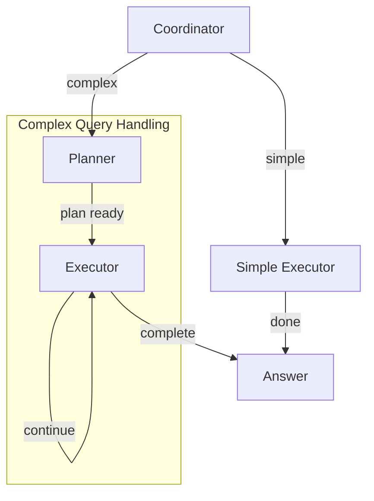

# Palantir OSDK Bot - System Design

> This document follows the [PocketFlow Agentic Coding Guide](https://the-pocket.github.io/PocketFlow/guide.html) for designing LLM systems.

## 1. Requirements

### Problem Statement

Users need to query, analyze, and visualize data from Palantir Foundry using natural language. The system should:

- Accept natural language questions about Foundry data
- Query the appropriate object types from the OSDK
- Analyze and aggregate data as needed
- Generate visualizations when requested
- Maintain conversation context for follow-up questions

### Use Cases

1. **Simple lookups**: "Show me all completed experiments"
2. **Filtered queries**: "List samples using Polysorbate 80"
3. **Aggregations**: "How many results do we have per time point?"
4. **Comparisons**: "Compare turbidity across surfactants and concentrations"
5. **Visualizations**: "Create a chart showing viscosity by surfactant"

### AI System Fit

- ✅ **Good fit**: Routine data queries requiring natural language understanding
- ✅ **Good fit**: Structured data retrieval with well-defined schemas
- ✅ **Good fit**: Pattern recognition for query classification
- ✅ **Good fit**: Multi-step analysis with coordinator-planner architecture

## 2. Flow Design

### Multi-Agent Flow (Coordinator-Planner-Executor)

The system uses a multi-agent approach that separates concerns:

- **Coordinator**: Classifies query complexity (simple vs complex)
- **Planner**: Creates execution plans for complex queries
- **Executor**: Runs individual plan steps



**When to use**: Complex queries requiring multiple data fetches, cross-object analysis, or multi-dimensional comparisons.

## 3. Utilities

### `call_llm` (utils/call_llm.py)

- **Input**: `prompt: str`, `system_prompt: str`, `history: list`
- **Output**: `str` (LLM response)
- **Necessity**: Core function for all LLM-based decisions and generation

### `extract_yaml` (utils/call_llm.py)

- **Input**: `text: str` (LLM response containing YAML)
- **Output**: `dict` (parsed YAML)
- **Necessity**: Parse structured LLM outputs for action routing

### `get_osdk_client` (utils/osdk_client.py)

- **Input**: None (uses environment variables)
- **Output**: `BaseOSDKClient` instance
- **Necessity**: Factory for OSDK client (mock or real)

### OSDK Client Methods

| Method                                    | Input                            | Output       | Necessity                      |
| ----------------------------------------- | -------------------------------- | ------------ | ------------------------------ |
| `list_object_types()`                     | None                             | `List[str]`  | Discover available data        |
| `get_object_schema(type)`                 | `str`                            | `dict`       | Understand object structure    |
| `query_objects(type, filters, limit)`     | `str`, `dict`, `int`             | `DataFrame`  | Fetch data (with rich filters) |
| `query_objects_paginated(...)`            | `str`, `dict`, pagination params | `dict`       | Paginated fetch with ordering  |
| `get_linked_objects(type, pk, link)`      | `str`, `str`, `str`              | `DataFrame`  | Traverse relationships         |
| `aggregate_objects(type, group_by, aggs)` | `str`, `List`, `dict`            | `DataFrame`  | Server-side aggregations       |
| `list_link_types(type)`                   | `str`                            | `List[dict]` | Discover available links       |

### Rich Filter Operators

The OSDK client supports advanced filtering:

| Operator      | Description          | Example                                     |
| ------------- | -------------------- | ------------------------------------------- |
| `$eq`         | Equal to             | `{"status": {"$eq": "completed"}}`          |
| `$ne`         | Not equal            | `{"status": {"$ne": "cancelled"}}`          |
| `$gt/$gte`    | Greater than (or eq) | `{"value": {"$gt": 50}}`                    |
| `$lt/$lte`    | Less than (or eq)    | `{"ph": {"$lt": 7.5}}`                      |
| `$in/$nin`    | In / not in list     | `{"surfactant": {"$in": ["PS80", "PS20"]}}` |
| `$contains`   | Text contains        | `{"name": {"$contains": "stability"}}`      |
| `$startswith` | Text starts with     | `{"id": {"$startswith": "SAM00"}}`          |

### `generate_chart` (utils/visualization.py)

- **Input**: `data: DataFrame`, `chart_spec: dict`
- **Output**: `plotly.Figure`
- **Necessity**: Convert LLM chart specifications to visualizations

## 4. Data Design (Shared Store)

```python
shared = {
    # User Query Context
    "current_query": str,           # The user's question
    "messages": list,               # Conversation history for context

    # OSDK Context
    "object_types": list,           # Available object types
    "schemas": dict,                # Cached schemas {type: schema}

    # Execution State
    "current_decision": dict,       # Latest LLM decision
    "iteration": int,               # Loop counter (safety limit)

    # Data
    "fetched_data": DataFrame,      # Most recent query results
    "accumulated_data": dict,       # Multi-step data {step_id: DataFrame}
    "analysis_result": str,         # LLM analysis output

    # Output
    "figure": Figure,               # Plotly chart if generated
    "final_answer": str,            # Response to user

    # Transparency
    "thinking_steps": list,         # [{type, content}, ...] for UI

    # Multi-Agent Specific
    "query_complexity": str,        # "simple" | "complex"
    "execution_plan": list,         # Plan steps for complex queries
    "current_step": int,            # Current plan step index
}
```

## 5. Node Design

### Multi-Agent Nodes

| Node               | prep()                | exec()                        | post()                                      |
| ------------------ | --------------------- | ----------------------------- | ------------------------------------------- |
| **Coordinator**    | Get query             | LLM classifies complexity     | Return "execute_simple" or "plan"           |
| **Planner**        | Get query + schemas   | LLM creates step-by-step plan | Store plan, return "execute_plan"           |
| **Executor**       | Get current plan step | Execute step action           | Advance step, return "continue" or "answer" |
| **SimpleExecutor** | Get query             | Determine single query needed | Execute and store, return "answer"          |

## 6. Implementation Notes

### Thinking Transparency

All nodes log their prompts and responses to `shared["thinking_steps"]`:

```python
def log_thinking(shared, step_type, content):
    if "thinking_steps" not in shared:
        shared["thinking_steps"] = []
    shared["thinking_steps"].append({
        "type": step_type,
        "content": content,
    })
```

### Safety Limits

- Maximum 10 iterations in decision loop
- Retry logic on OSDK queries (max_retries=2, wait=1)

### YAML Structured Output

LLM responses use YAML for structured data:

```yaml
thinking: |
  <step-by-step reasoning>
action: query_osdk
parameters:
  object_type: Experiment
  filters:
    status: completed
    budget: { "$gte": 50000 }
  limit: 100
reason: Need to fetch completed experiments with budget >= 50k
```

Supported filter operators: `$eq`, `$ne`, `$gt`, `$gte`, `$lt`, `$lte`, `$in`, `$nin`, `$contains`, `$startswith`

## 7. Integration Guide

### Using with Real Palantir OSDK

1. Generate your OSDK package using Palantir's SDK generator
2. Implement `PalantirOSDKClient` in `utils/osdk_client.py`:

```python
from your_generated_osdk import FoundryClient

class PalantirOSDKClient(BaseOSDKClient):
    def __init__(self):
        self.client = FoundryClient()

    def list_object_types(self):
        return [obj.__name__ for obj in self.client.ontology.objects]

    def query_objects(self, object_type, filters=None, limit=100):
        obj_class = getattr(self.client.ontology.objects, object_type)
        query = obj_class

        if filters:
            for field, value in filters.items():
                query = query.where(getattr(obj_class, field) == value)

        results = query.take(limit)
        return pd.DataFrame([obj.__dict__ for obj in results])
```

3. Set environment variable: `USE_MOCK_OSDK=false`

### Adding New Object Types

The system automatically discovers object types from the OSDK client. For mock data:

1. Add data generation in `MockOSDKClient._initialize_mock_data()`
2. Add schema in `self._schemas`
3. Add to `self._data` mapping

## 8. Future Enhancements

- [x] Rich filter operators ($gt, $lt, $in, $contains, etc.)
- [x] Pagination support with auto-pagination option
- [x] Server-side aggregations (sum, mean, count, min, max, median)
- [x] Link discovery for relationship traversal
- [ ] Streaming responses for long-running queries
- [ ] Caching layer for repeated queries
- [ ] Export results to CSV/Excel
- [ ] Save/load conversation sessions
- [ ] Support for OSDK Actions (write operations)
- [ ] Vector search for semantic query matching
- [ ] Attachment handling for file-linked objects
